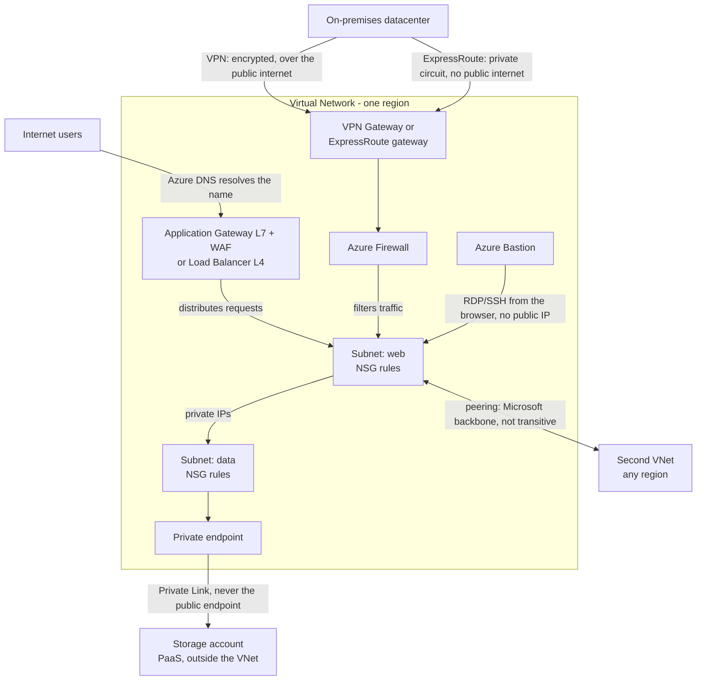

# Azure networking: VNets, connectivity, security, and traffic distribution

Azure networking lets resources communicate privately, reach the internet, and connect to on-premises environments. AZ-900 focuses on **what each service does**, not subnetting math.

One idea holds the whole topic together: a **virtual network is isolated by default**. Every service on this page is a deliberate, named way of letting traffic in, out, or across that boundary. Most exam questions are really asking a single thing: *which connector or filter matches this scenario?*

## How the pieces fit together

Three ways in, one way to filter, one way to pull managed services inside the boundary. The rest of this page walks each of them.

## Azure Virtual Network (VNet)

A virtual network is your **isolated private network** in Azure. You define its address space with a private IP range, and resources placed inside it receive private IP addresses.

Use a VNet when the scenario mentions:

- private IP communication between Azure resources;
- network segmentation;
- controlling inbound and outbound traffic;
- hybrid connectivity to on-premises networks.

Two boundaries matter for the exam:

- a VNet belongs to **one region** and **one subscription**;
- resources in the same VNet can reach each other by default, including across subnets.

**Exam rule:** isolated private network in Azure → **Virtual Network**.

**Exam trap:** a single VNet cannot span two regions. Multi-region designs use one VNet per region, connected with global VNet peering.

## Subnets

Subnets divide a VNet into smaller address ranges. Resources such as VMs, private endpoints, and some PaaS integrations are placed into subnets.

Subnets help with:

- organization and segmentation;
- applying route tables and network security groups;
- controlling which services can be deployed in which segment.

Some services require their own dedicated subnet, including VPN Gateway (`GatewaySubnet`), Azure Firewall (`AzureFirewallSubnet`), and Azure Bastion (`AzureBastionSubnet`).

## Filtering traffic: NSG and Azure Firewall

Both block unwanted traffic, at very different scales. The exam tests the difference constantly.

| | Network security group (NSG) | Azure Firewall |
|---|---|---|
| What it is | A list of **allow/deny rules** evaluated by priority | A **managed, stateful firewall service** |
| Matches on | Source, destination, port, protocol, direction | Network rules plus application rules, including **FQDN** filtering |
| Attaches to | A **subnet** or a network interface | Its own subnet; protects entire VNets, including across peered VNets |
| Extra capability | None beyond static rules | Threat intelligence, centralized policy, logging |
| Cost | **Free** | Billed per hour and per volume of traffic |

An NSG has default rules that already allow traffic inside the VNet and outbound traffic to the internet, while denying inbound traffic from the internet. Your rules layer on top of those.

These services are not rivals. A common design uses Azure Firewall at the perimeter and NSGs on each subnet as a second layer.

**Exam rules:**

- filter traffic to a subnet or a NIC with rules → **network security group**;
- managed, centralized, intelligence-driven network protection → **Azure Firewall**.

## Connecting networks

### VNet peering

VNet peering connects two Azure virtual networks so resources in each can communicate over the **Microsoft backbone** using private addresses.

Peering can connect:

- VNets in the same region;
- VNets in different regions (global VNet peering).

Peering is not a substitute for hybrid connectivity to on-premises datacenters.

**Exam trap:** peering is **not transitive**. If VNet A is peered with VNet B, and VNet B is peered with VNet C, resources in A still cannot reach C. That needs a direct peering, or routing through a hub appliance such as Azure Firewall.

### Hybrid connectivity

| Requirement | Service | Connection path |
|---|---|---|
| Encrypted connection over the **public internet** | VPN Gateway | Site-to-site VPN uses IPsec/IKE; point-to-site supports secure VPN protocols |
| Private dedicated connection that **avoids the public internet** | ExpressRoute | Dedicated private link through a connectivity provider |
| Quick temporary hybrid link for testing | VPN Gateway | Common exam answer for internet-based hybrid |

**Exam rules:**

- public internet, encrypted hybrid → **VPN Gateway**;
- private, dedicated, no public internet → **ExpressRoute**.

VPN Gateway comes in two shapes that the exam likes to separate:

- **Site-to-site (S2S)** connects an entire on-premises network to a VNet, always on.
- **Point-to-site (P2S)** connects a **single client device**, such as a laptop belonging to a remote employee.

### ExpressRoute peering types

New ExpressRoute circuits can use two peering types:

- **Azure private peering** connects an on-premises network to Azure VNets through private IP addresses.
- **Microsoft peering** connects to Microsoft public services through public IP addresses advertised over the private ExpressRoute circuit.

Azure public peering is deprecated. Do not treat it as a current third peering option.

### Private does not automatically mean encrypted

ExpressRoute traffic avoids the public internet, but it is **not encrypted by default**. Encryption can be added with options such as MACsec on ExpressRoute Direct or an IPsec tunnel, depending on the design.

At AZ-900 level, remember:

- **VPN Gateway:** encrypted tunnel over the public internet.
- **ExpressRoute:** private connectivity that avoids the public internet; encryption is a separate design choice.

## Reaching an application: DNS and traffic distribution

### Azure DNS

Azure DNS hosts DNS domains and records. It can:

- host public DNS zones for internet name resolution;
- provide name resolution for resources inside a VNet with a private DNS zone.

**Exam clue:** manage DNS records for your domain in Azure → **Azure DNS**.

### The four load-balancing options

Once a name resolves, something has to spread the traffic. Azure separates these along two axes: which network layer the service understands, and whether it works inside one region or across the globe.

| Service | Layer | Scope | Distinguishing capability |
|---|---|---|---|
| **Azure Load Balancer** | Layer 4 (TCP/UDP) | Regional | Distributes any TCP/UDP traffic across a backend pool using health probes |
| **Application Gateway** | Layer 7 (HTTP/S) | Regional | Routes by **URL path** or host name, terminates TLS, and can add a **web application firewall** |
| **Traffic Manager** | DNS-based | Global | Directs clients to a regional endpoint by returning different DNS answers |
| **Azure Front Door** | Layer 7 (HTTP/S) | Global | Global HTTP entry point with WAF and content acceleration |

A **web application firewall (WAF)** inspects HTTP requests and blocks common web attacks such as SQL injection and cross-site scripting. It is available on Application Gateway and Front Door, not on Load Balancer.

**Exam rules:**

- distribute network traffic across VMs, no mention of HTTP → **Azure Load Balancer**;
- route based on URL path, or protect a web app from web attacks → **Application Gateway**, with WAF if the attack names appear;
- the same requirement stated **globally**, across regions → **Front Door**.

## Protecting resources at the edge

- **Azure Bastion** provides RDP and SSH access to VMs **through the Azure portal in a browser**, over TLS. The VMs keep only private IP addresses and ports 3389 and 22 stay closed to the internet.
- **Azure DDoS Protection** defends against distributed denial-of-service attacks. Platform-level protection applies to Azure infrastructure at no extra cost; the paid tiers add tuning to your own applications, attack telemetry, alerting, and cost protection for your public IP addresses.
- **Private endpoints** give a PaaS service a private IP address inside your VNet so traffic reaches it over Private Link instead of its public endpoint. This is covered in detail in [Public and private endpoints](06-public-and-private-endpoints.md).

**Exam rule:** administrative access to a VM without exposing it to the internet → **Azure Bastion**.

## Scenario

A company needs its Azure VMs to reach an on-premises datacenter securely without sending traffic over the public internet.

**Best fit:** **ExpressRoute**.

## Scenario

A branch office must connect to Azure for a pilot project with minimal setup cost, and using the public internet is acceptable if encrypted.

**Best fit:** **VPN Gateway**.

## Scenario

A web application serves `/images` from one pool of servers and `/api` from another, and must be protected against SQL injection.

**Best fit:** **Application Gateway with WAF enabled**. Path-based routing requires a Layer 7 service, and WAF covers the attack requirement.

## Common exam traps

1. One VNet belongs to **one region**. Multi-region always means multiple VNets plus peering.
2. Peering is **not transitive**.
3. An NSG is a free rule list on a subnet or NIC; Azure Firewall is a paid managed service. They are not interchangeable.
4. "Does not use the public internet" means **ExpressRoute** from on-premises, or **peering** and **private endpoints** inside Azure. A VPN is encrypted but still travels the internet.
5. A single remote worker needs **point-to-site**; a whole office needs **site-to-site**.
6. URL-based routing and WAF belong to **Application Gateway**, never to Load Balancer.
7. Azure Bastion removes the need for **public IP addresses on VMs**; it does not replace NSGs or a firewall.
8. ExpressRoute is private but **not encrypted by default**.

## Scenario drill

Answer each one before reading the next section.

1. A datacenter must connect to Azure over a connection that does not route across the public internet. Which service?
2. You must filter inbound traffic to a subnet by source IP and port at no additional cost. Which service?
3. VNet1 is peered with VNet2, and VNet2 is peered with VNet3. Can a VM in VNet1 reach a VM in VNet3?
4. Administrators must open RDP sessions to VMs, but policy forbids public IP addresses on any VM. Which service?
5. A web application must send `/video` requests to one backend pool and `/api` to another. Which service?
6. One travelling employee needs secure access to VNet resources from a personal laptop. Which connection type?
7. An application in a VNet must reach an Azure Storage account without the traffic leaving the private network. Which feature?
8. A public web application must be protected against SQL injection and cross-site scripting. Which feature?
9. Two VNets in different regions must communicate privately with low latency. Which service?
10. Can a single virtual network span the East US and West Europe regions?
11. Traffic to a set of VMs must be distributed across instances, and the application uses a custom TCP protocol rather than HTTP. Which service?
12. A company needs centralized, managed network filtering with FQDN rules and threat intelligence across several peered VNets. Which service?

## Drill answers

1. **ExpressRoute.** The phrase "does not route across the public internet" is the ExpressRoute signature. A VPN tunnel is encrypted but still uses the internet.
2. **Network security group.** Rules, a subnet, and no additional cost together point to an NSG rather than Azure Firewall.
3. **No.** Peering is not transitive. VNet1 needs a direct peering to VNet3, or routing through a hub appliance.
4. **Azure Bastion.** Browser-based RDP and SSH through the portal lets the VMs keep private IP addresses only.
5. **Application Gateway.** Routing by URL path requires Layer 7. Load Balancer sees only IP addresses and ports.
6. **Point-to-site VPN.** A single client device is the point-to-site case; an entire office network would be site-to-site.
7. **A private endpoint.** It projects the storage account into the VNet with a private IP so traffic uses Private Link.
8. **Web application firewall (WAF)**, on Application Gateway or Front Door. Named OWASP-style attacks point to WAF, not to an NSG or DDoS Protection.
9. **Global VNet peering.** It uses the Microsoft backbone and is the intended answer for VNet-to-VNet connectivity.
10. **No.** A VNet exists in exactly one region. Use one VNet per region connected by global peering.
11. **Azure Load Balancer.** A non-HTTP protocol rules out the Layer 7 services and leaves the Layer 4 load balancer.
12. **Azure Firewall.** Managed, centralized, FQDN filtering, and threat intelligence across VNets are all Azure Firewall capabilities.

## Exam clues

- Private network in Azure → **VNet**.
- Two Azure VNets must talk privately → **VNet peering**.
- Rule-based filtering on a subnet or NIC → **network security group**.
- Managed, centralized network filtering → **Azure Firewall**.
- Hybrid over encrypted internet → **VPN Gateway**.
- A single remote device connecting to a VNet → **point-to-site VPN**.
- Hybrid without public internet → **ExpressRoute**.
- Host your DNS zone → **Azure DNS**.
- Distribute non-HTTP traffic across VMs → **Azure Load Balancer**.
- Route by URL, or protect a web app → **Application Gateway**, with **WAF** for attack protection.
- Global HTTP entry point → **Azure Front Door**.
- RDP or SSH without a public IP → **Azure Bastion**.
- Absorb volumetric attacks against your public IPs → **Azure DDoS Protection**.

## Official references

- [Azure Virtual Network overview](https://learn.microsoft.com/azure/virtual-network/virtual-networks-overview)
- [Network security groups overview](https://learn.microsoft.com/azure/virtual-network/network-security-groups-overview)
- [Azure Firewall overview](https://learn.microsoft.com/azure/firewall/overview)
- [Virtual network peering overview](https://learn.microsoft.com/azure/virtual-network/virtual-network-peering-overview)
- [ExpressRoute circuits and peering](https://learn.microsoft.com/azure/expressroute/expressroute-circuit-peerings)
- [Encryption for ExpressRoute](https://learn.microsoft.com/azure/expressroute/expressroute-about-encryption)
- [Load-balancing options in Azure](https://learn.microsoft.com/azure/architecture/guide/technology-choices/load-balancing-overview)
- [Application Gateway overview](https://learn.microsoft.com/azure/application-gateway/overview)
- [Azure Bastion overview](https://learn.microsoft.com/azure/bastion/bastion-overview)
- [Azure DDoS Protection overview](https://learn.microsoft.com/azure/ddos-protection/ddos-protection-overview)
- [VPN Gateway vs ExpressRoute — Microsoft Learn](https://learn.microsoft.com/training/modules/describe-azure-compute-networking-services/4-describe-azure-virtual-networks)
